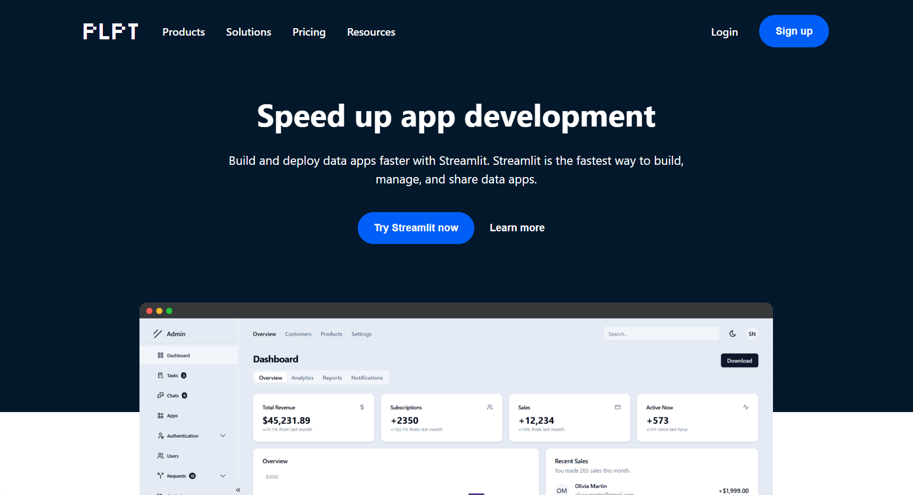
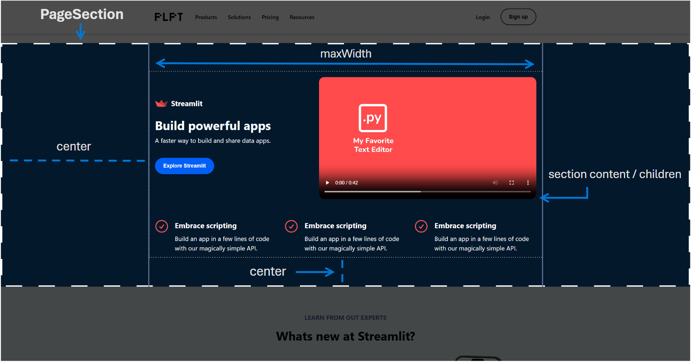

>[!WARNING]
> This project is still in early development and is not yet ready for production use. Feel free to contribute to the project by submitting a pull request or opening an issue.



# Product Landing Page Template (React)

This is a product landing page template built with React. It is a simple, responsive, configurable, and easy-to-use template that you can use to showcase your product or service.

## Features

- **Responsive design.** The template is fully responsive and works on desktop, tablet, and mobile devices.
- **Pure React.** Does not rely on any 3rd party libraries or frameworks apart from `react` and `react-icons`. The latter can easily be removed if you don't want to use the icons.
- **Conventional appearance.** Takes visual inspiration from the [Adjust](https://www.adjust.com/) and [Streamlit](https://www.streamlit.io/) landing pages.
- **Reusable components.** The template is built with reusable components that you can easily customize and reuse. You can find these in the `src/components` directory.
- **Custom hooks.** The template uses custom hooks to detect window widths and window scroll positions. You can find these in the `src/hooks` directory.
- **Free assets.** The template uses free assets from [Icon 8](https://icons8.com/illustrations) and [Streamlit](https://www.streamlit.io/). You can find these in the `public` directory.

## Getting Started

To get started with the template, you can clone the repository and install the dependencies:

```bash
git clone https://github.com/bouzidanas/product-page-template.git
```
Change into the project directory:
```bash
cd product-page-template
```
Use your package manager to install the dependencies. If you are using npm, you can run:
```bash
npm install
```
You can test the template by running:
```bash
npm run dev
```

>[!NOTE]
> The template is built with Vite. You can find more information about Vite [here](https://vitejs.dev/). It also uses icons from [React Icons](https://react-icons.github.io/react-icons/).


## Using the Template to Build Your Product Landing Page

The quick and dirty:

1. Copy the `adjust_example` directory in the `src/` directory.
2. Paste it into your project to create a new directory for your product or service. 
3. Rename the directory and the files inside it to match your product or service.
4. Update the imports inside `main.tsx` to point to the renamed files.
5. In the CSS file (in your newly added directory), you can change the css variables and properties to match your brand colors and styles.
6. In the TSX files (in your newly added directory), you can:
    - Change the content of the sections to match your product or service.
    - Change the icons to match your product or service.
    - Add or remove content as needed.
    - Create your own sections based on the existing ones.

## Components

### `PageSection`

The `PageSection` component is a simple component that you can use to create sections on your landing page. It takes the following props:

| Prop | Type | Description |
| --- | --- | --- |
| `vertical` | `boolean` | If `true`, the section contents will be stacked vertically (flexbox). If `false`, the section will default to horizontal stacking. |
| `light` | `boolean` | If `true`, the section will have a data-attribute set that triggers light mode. |
| `dark` | `boolean` | If `true`, the section will have a data-attribute set that triggers dark mode. |
| `centerText` | `boolean` | If `true`, the text-nodes inside the section (direct children) will be centered. |
| `height` | `"full"` or `"fit"` or `string` or `number` | The height of the section. |
| `maxHeight` | `"full"` or `string` or `number` | The maximum height of the section. |
| `maxWidth` | `"full"` or `string` or `number` | The maximum width of the section content (not section). The width of the section is always `100%` |
| `gap` | `"none"` or `"small"` or `"medium"` or `"large"` or `string` or `number` | The gap between the section content (not section) elements i.e. children. |
| `padding` | `"none"` or `"small"` or `"medium"` or `"large"` or `string` or `number` | The padding of the section of the section. |
| `scrollTop` | `string` or `number` | The distance below the top of the section that is scrolled to when a link to this section is clicked. Allows for shift that accomodates header bars for example. |
| `scrollBottom` | `string` or `number` | The distance above the bottom of the section that is scrolled to when a link to this section is clicked. |
| `fontScale` | `number` | A font-size multiplier for resizing text inside the section |
| `bgColor` | `string` or `[string, string]` or `[string, string, string]` | The background color of the section. If an array is provided, the section will have a split, two color background. |
| `className` | `string` | A class name to apply to the section. |
| `style` | `React.CSSProperties` | A style object to apply to the section content (not outter section). |
| `id` | `string` | An id to apply to the section. |

#### Defaults


The power of the `PageSection` component is what it configures for you given little input saving you time and effort. By default, this component will 
    1. center the section content (inside) both horizontally and vertically. 
    2. fit its width to its parent container.
    3. add a gap between the section content elements.
    4. adjust its own height to fit its content.
    5. stack its content elements horizontally.
   


## Contributing

If you would like to contribute to the project, you can do so by submitting a pull request or opening an issue.

## License

This project is licensed under the [MIT License](https://github.com/bouzidanas/product-page-template?tab=MIT-1-ov-file#readme).